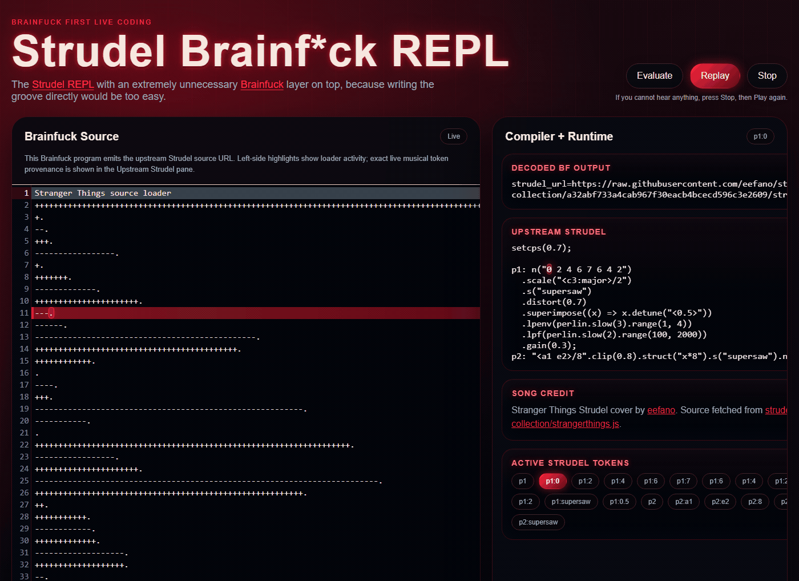

# Strudel Brainfuck REPL

A browser demo that puts a Brainfuck layer on top of the Strudel REPL. 



## Quickstart

Requirements:

- Node.js `24.13.0` or newer
- npm `11.6.2` or newer

Run the interface:

```sh
npm install
npm run dev
```

Open `http://localhost:5173`, wait for the upstream Strudel source to load, then
click `Play`.

The first play can take a few seconds while the browser audio runtime starts.
This branch requires network access to fetch the credited upstream song source.

## Scripts

```sh
npm run dev         # start the Vite web app
npm run test        # run workspace unit and parity tests
npm run typecheck   # run TypeScript checks
npm run build       # build all workspaces
npm run test:e2e    # run Playwright browser tests
```

If Playwright reports a missing browser executable after a fresh install, run:

```sh
npx playwright install chromium
```

## Repository Layout

- `apps/web`: Vite and React interface
- `packages/bf-core`: Brainfuck tokenizer, bracket map, VM, and trace model
- `packages/music-compiler`: protocol decoder, music IR, renderer, and source maps
- `packages/strudel-runtime`: Strudel compile/playback bridge
- `packages/editor-bf`: CodeMirror Brainfuck editor support
- `packages/shared`: shared range and source-map utilities
- `fixtures`: demo Brainfuck program and reference Strudel snippet
- `docs/adr`: short architecture decision records

## License And Attribution

This project is licensed under `AGPL-3.0-only`.

The runtime is built on Strudel packages, which are licensed as
`AGPL-3.0-or-later` in their installed package metadata. The editor uses
CodeMirror, and the interface uses React and Vite. See
`THIRD_PARTY_NOTICES.md` for the main upstream projects and attribution notes.

The Stranger Things Strudel cover is by
[eefano](https://github.com/eefano) and is fetched from
[eefano/strudel-songs-collection](https://github.com/eefano/strudel-songs-collection)
at runtime. That upstream repository does not declare a license in GitHub
metadata, so this branch links to and fetches the song source instead of
vendoring a copy into this repository.
